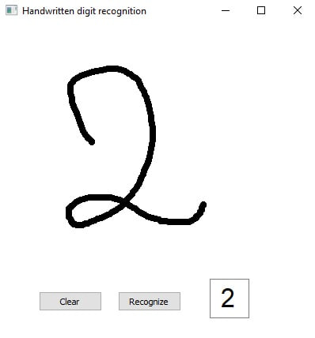

# ✍️ Handwritten Digit Recognition System using Deep Learning

## 📌 Overview
This project presents a Deep Learning model that recognizes handwritten digits (0–9) using the MNIST dataset. The model classifies grayscale images of handwritten digits and predicts the corresponding digit with high accuracy.

---

## 🎯 Objective
The main objective of this project is to build an accurate image classification model capable of recognizing handwritten digits from the MNIST dataset using Deep Learning techniques.

---

## 📊 Dataset

The project uses the **MNIST** dataset, which contains:

- 70,000 handwritten digit images
- 28×28 grayscale images
- 10 classes representing digits (0–9)
- 60,000 training images
- 10,000 testing images

---

## ⚙️ Workflow

1. Load the MNIST dataset
2. Data preprocessing (Normalization & Reshaping)
3. Build the CNN model
4. Train the model
5. Evaluate the model
6. Predict handwritten digits

---

## 🤖 Model Used

- Convolutional Neural Network (CNN)

---

## 📈 Evaluation Metrics

- Accuracy
- Loss
- Confusion Matrix

---

## 🖼️ Results

### Final Prediction Result



The trained CNN model successfully recognizes handwritten digits from the MNIST dataset with high accuracy.

---

## 🚀 Key Insights

- CNN models provide excellent performance for handwritten digit recognition.
- Data normalization improves model convergence and stability.
- The trained model accurately classifies unseen handwritten digits.

---

## 🛠️ Technologies Used

- Python
- NumPy
- Matplotlib
- TensorFlow
- Keras
- Jupyter Notebook

---

## ▶️ How to Run

```bash
git clone https://github.com/Meriam-aziz/MNIST-Handwritten-Digit-Recognition-with-Deep-Learning.git

cd MNIST-Handwritten-Digit-Recognition-with-Deep-Learning

pip install -r requirements.txt

jupyter notebook AI.ipynb
```

---

## 📁 Project Structure

```text
MNIST-Handwritten-Digit-Recognition-with-Deep-Learning/
│
├── AI.ipynb
├── final_result.png
├── README.md
└── requirements.txt
```

---

## 👩‍💻 Author

**Meriam Aziz**

---

## ⭐ Future Improvements

- Deploy the model using Streamlit or Flask.
- Add a real-time handwritten digit drawing interface.
- Improve the CNN architecture for higher accuracy.
- Extend the project to recognize handwritten letters and characters.

